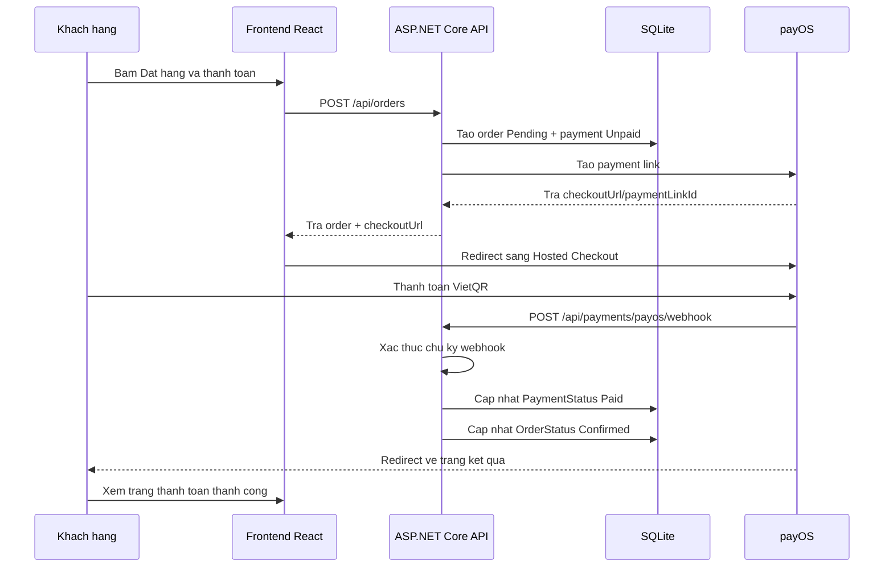

# Đánh giá tích hợp payOS cho project Tiệm Bánh Bé Yêu

Ngày đánh giá: 15/05/2026

## Kết luận nhanh

Project hiện tại **có thể tích hợp payOS** và mức độ phù hợp là **cao** nếu mục tiêu chính là thanh toán quốc nội tại Việt Nam bằng VietQR/chuyển khoản ngân hàng tự động.

Lý do:

- Backend đang dùng ASP.NET Core Minimal API, dễ thêm nhóm endpoint `/api/payments`.
- Database đã có bảng `Orders` và `OrderItems`, phù hợp để gắn thêm thông tin thanh toán.
- Frontend React đã có trang checkout riêng tại `frontend/src/pages/checkout.tsx`.
- Luồng đặt hàng hiện đã tạo đơn thành công, chỉ thiếu bước tạo link thanh toán và nhận webhook từ cổng thanh toán.
- payOS hỗ trợ Hosted Checkout, link thanh toán, webhook và xác thực chữ ký, phù hợp với kiến trúc frontend/backend hiện tại.

Điểm cần lưu ý: project hiện tại mới có **COD**, chưa có `PaymentStatus`, `PaymentMethod`, `PaymentLinkId`, `PaidAt` hoặc bảng giao dịch thanh toán riêng. Vì vậy không nên chỉ đổi chữ COD thành payOS ở giao diện; cần bổ sung lớp dữ liệu và webhook để tránh sai lệch trạng thái đơn hàng.

## Hiện trạng project

### Công nghệ đang dùng

- Frontend: React, TypeScript, Vite, Tailwind CSS, Axios.
- Backend: ASP.NET Core 8 Minimal API.
- Database: SQLite qua Entity Framework Core.
- Xác thực: JWT.
- Quản trị: đã có trang admin và API quản lý đơn hàng.

### Luồng checkout hiện tại

1. Người dùng đăng nhập.
2. Người dùng vào trang `CheckoutPage`.
3. Frontend gửi request `POST /api/orders`.
4. Backend kiểm tra thông tin khách hàng, địa chỉ, sản phẩm và tồn kho.
5. Backend trừ tồn kho ngay khi tạo đơn.
6. Backend tạo đơn với `OrderStatus.Pending`.
7. Frontend xóa giỏ hàng và hiển thị đặt hàng thành công.

### Hạn chế hiện tại nếu thêm thanh toán online

- Chưa phân biệt trạng thái đơn hàng và trạng thái thanh toán.
- Tồn kho bị trừ ngay cả khi khách chưa thanh toán.
- Chưa có nơi lưu mã giao dịch từ cổng thanh toán.
- Chưa có webhook endpoint để payOS gọi về.
- Chưa có màn hình xử lý khi khách quay lại từ trang thanh toán.
- Admin chỉ thấy trạng thái đơn, chưa thấy đơn đã thanh toán hay chưa.

## Vì sao nên chọn payOS cho project này

payOS phù hợp với website này vì đây là cửa hàng bán bánh/kẹo cho khách Việt Nam, giá trị đơn hàng thường nhỏ hoặc vừa, cần thanh toán nhanh, dễ hiểu và ít chi phí vận hành.

Theo thông tin chính thức từ payOS, dịch vụ đang truyền thông là cổng thanh toán miễn phí khởi tạo, miễn phí duy trì và miễn phí giao dịch không giới hạn. payOS dùng tài khoản ngân hàng của merchant để xác nhận thanh toán, hỗ trợ tạo link thanh toán, Hosted Checkout và webhook để cập nhật trạng thái đơn hàng.

Nguồn tham khảo:

- https://payos.vn/
- https://payos.vn/docs/
- https://payos.vn/docs/api/
- https://docs.payos.money/hosted-checkout
- https://docs.payos.money/core-concepts-webhooks

## Mức độ đáp ứng các tiêu chí

| Tiêu chí | Đánh giá với payOS | Cách project nên triển khai |
|---|---|---|
| Hình thức và nội dung trang web | Tốt | Thêm lựa chọn "Thanh toán VietQR qua payOS" trong checkout, hiển thị trạng thái thanh toán rõ ràng, giữ COD làm phương án dự phòng |
| Thanh toán quốc nội | Rất tốt | Dùng payOS cho VietQR/chuyển khoản ngân hàng nội địa |
| Thanh toán quốc tế | Chưa phải thế mạnh chính | Ghi rõ payOS phục vụ nội địa; nếu cần quốc tế nên bổ sung PayPal hoặc cổng thẻ quốc tế sau |
| Mức độ an toàn và bảo mật | Tốt nếu triển khai đúng | Lưu khóa trong biến môi trường, xác thực webhook bằng chữ ký HMAC SHA256, không tin dữ liệu trả về từ frontend |
| Tính tương thích và ổn định | Tốt | Dùng Hosted Checkout để giảm lỗi giao diện thanh toán, backend xử lý webhook idempotent |
| Đa dạng phương thức thanh toán | Khá cho thị trường Việt Nam | Có VietQR/ngân hàng; giữ COD; sau này có thể thêm ví hoặc PayPal |
| Tính năng hỗ trợ xử lý đơn hàng | Tốt sau khi bổ sung trạng thái thanh toán | Admin lọc đơn chưa thanh toán, đã thanh toán, hết hạn, hủy |
| Khả năng mở rộng quản lý | Tốt nếu thiết kế tách lớp | Tạo `Payment` entity/service riêng để sau này thêm PayPal, VNPAY, ZaloPay mà không sửa nhiều luồng đơn hàng |

## Kiến trúc đề xuất

Nên tách **đơn hàng** và **thanh toán** thành hai khái niệm riêng.



## Thay đổi database nên có

### Cách tối thiểu

Thêm các field trực tiếp vào `Order`:

```csharp
public PaymentMethod PaymentMethod { get; set; } = PaymentMethod.Cod;
public PaymentStatus PaymentStatus { get; set; } = PaymentStatus.Unpaid;
public string? PaymentProvider { get; set; }
public string? PaymentReference { get; set; }
public string? PaymentCheckoutUrl { get; set; }
public DateTime? PaidAt { get; set; }
public DateTime? PaymentExpiredAt { get; set; }
```

Enum đề xuất:

```csharp
public enum PaymentMethod
{
    Cod,
    PayOs
}

public enum PaymentStatus
{
    Unpaid,
    Pending,
    Paid,
    Failed,
    Cancelled,
    Expired
}
```

### Cách nên dùng để mở rộng

Tạo bảng riêng `Payments`:

```csharp
public class Payment
{
    public int Id { get; set; }
    public int OrderId { get; set; }
    public Order Order { get; set; } = null!;
    public string Provider { get; set; } = "payos";
    public string Method { get; set; } = "vietqr";
    public string Status { get; set; } = "pending";
    public long PayOsOrderCode { get; set; }
    public string? PaymentLinkId { get; set; }
    public string? CheckoutUrl { get; set; }
    public string? TransactionReference { get; set; }
    public decimal Amount { get; set; }
    public DateTime CreatedAt { get; set; } = DateTime.UtcNow;
    public DateTime? PaidAt { get; set; }
    public DateTime? ExpiredAt { get; set; }
}
```

Với project này, cách nên dùng là **tạo bảng `Payments` riêng**, vì tiêu chí có "đa dạng phương thức thanh toán" và "khả năng mở rộng quản lý".

## API cần thêm

### Tạo đơn hàng

Hiện tại:

```http
POST /api/orders
```

Nên mở rộng request để nhận phương thức thanh toán:

```json
{
  "customerInfo": {
    "name": "Nguyen Van A",
    "phone": "0912345678",
    "email": "a@example.com"
  },
  "shippingAddress": {
    "province": "TP. Ho Chi Minh",
    "ward": "Phuong 1",
    "address": "123 Duong ABC"
  },
  "paymentMethod": "payos",
  "items": [
    {
      "productId": 1,
      "quantity": 2
    }
  ]
}
```

Response nên trả thêm `paymentUrl`:

```json
{
  "orderId": 10,
  "orderCode": "DH202605150001",
  "totalAmount": 150000,
  "paymentMethod": "payos",
  "paymentStatus": "pending",
  "paymentUrl": "https://checkout.payos.vn/...",
  "estimatedDelivery": "2026-05-18T00:00:00Z"
}
```

### Tạo thanh toán riêng

Nếu muốn tách rõ hơn:

```http
POST /api/orders/{orderId}/payments/payos
```

API này tạo payment link cho một đơn hàng đã có.

### Webhook payOS

Cần thêm endpoint public:

```http
POST /api/payments/payos/webhook
```

Endpoint này phải:

- Nhận dữ liệu từ payOS.
- Xác thực chữ ký bằng checksum/webhook signature theo tài liệu payOS.
- Tìm `Payment` theo `PayOsOrderCode` hoặc `PaymentLinkId`.
- Nếu đã xử lý rồi thì trả thành công, không cập nhật lặp.
- Nếu thanh toán thành công thì cập nhật `PaymentStatus.Paid`.
- Cập nhật `OrderStatus.Confirmed` hoặc giữ `Pending` nhưng hiển thị là "Đã thanh toán - chờ xác nhận".

### Kiểm tra trạng thái thanh toán

Nên thêm endpoint:

```http
GET /api/orders/{id}/payment-status
```

Frontend dùng endpoint này ở trang kết quả sau khi khách quay lại từ payOS. Webhook vẫn là nguồn sự thật chính; endpoint này chỉ để giao diện cập nhật mượt hơn.

## Thay đổi frontend

File chính cần sửa:

- `frontend/src/pages/checkout.tsx`
- `frontend/src/api/orders.ts`
- `frontend/src/types/order.ts`
- `frontend/src/pages/orders.tsx`
- `frontend/src/pages/admin/index.tsx`

### Trang checkout

Hiện chỉ có COD:

```tsx
<p className="font-medium">Thanh Toán Khi Nhận Hàng (COD)</p>
```

Nên đổi thành chọn phương thức:

- Thanh toán VietQR qua payOS.
- Thanh toán khi nhận hàng.

Luồng khi chọn payOS:

1. Người dùng bấm đặt hàng.
2. Frontend gọi `createOrder`.
3. Backend trả `paymentUrl`.
4. Frontend chuyển hướng:

```ts
window.location.href = result.paymentUrl;
```

Luồng khi chọn COD:

1. Frontend gọi `createOrder`.
2. Backend tạo đơn COD.
3. Frontend hiển thị đặt hàng thành công như hiện tại.

### Trang kết quả thanh toán

Nên thêm route:

```txt
/payment/result
```

Trang này hiển thị:

- Đang kiểm tra thanh toán.
- Thanh toán thành công.
- Thanh toán thất bại hoặc đã hủy.
- Nút xem đơn hàng.

Không nên chỉ dựa vào query string từ payOS để đánh dấu đã thanh toán. Frontend chỉ gọi backend kiểm tra, backend mới quyết định trạng thái cuối cùng.

## Thay đổi backend

File chính cần sửa/thêm:

- `backend/Domain/Entities/Order.cs`
- `backend/Domain/Entities/Payment.cs`
- `backend/Infrastructure/Persistence/AppDbContext.cs`
- `backend/DTOs/Orders/OrderDto.cs`
- `backend/Extensions/Endpoints/OrderEndpoints.cs`
- `backend/Extensions/Endpoints/PaymentEndpoints.cs`
- `backend/Program.cs`
- `backend/appsettings.json`

### Cấu hình payOS

Không nên hard-code key trong code hoặc commit trực tiếp vào repository.

Đề xuất cấu hình:

```json
{
  "PayOs": {
    "ClientId": "",
    "ApiKey": "",
    "ChecksumKey": "",
    "ReturnUrl": "http://localhost:5173/payment/result",
    "CancelUrl": "http://localhost:5173/payment/result?cancelled=true"
  }
}
```

Ở môi trường thật, dùng biến môi trường:

```bash
PayOs__ClientId=...
PayOs__ApiKey=...
PayOs__ChecksumKey=...
PayOs__ReturnUrl=https://your-domain.vn/payment/result
PayOs__CancelUrl=https://your-domain.vn/payment/result?cancelled=true
```

### Service payOS

Nên tạo:

```txt
backend/Domain/Settings/PayOsSettings.cs
backend/Infrastructure/Services/PayOsService.cs
```

`PayOsService` phụ trách:

- Tạo payment link.
- Gọi API payOS.
- Verify webhook signature.
- Parse trạng thái thanh toán.

Không nên để logic gọi payOS trực tiếp trong `OrderEndpoints.cs`, vì sau này thêm PayPal/VNPAY sẽ khó mở rộng.

## Xử lý tồn kho

Hiện tại backend trừ tồn kho ngay khi tạo đơn. Với payOS có 2 lựa chọn:

### Lựa chọn đơn giản

Vẫn trừ tồn kho khi tạo đơn, nhưng nếu thanh toán hết hạn hoặc hủy thì hoàn kho.

Ưu điểm:

- Ít thay đổi code.
- Tránh bán vượt tồn kho trong lúc khách đang thanh toán.

Nhược điểm:

- Cần job dọn đơn hết hạn để hoàn kho.
- Nếu khách tạo nhiều đơn nhưng không thanh toán sẽ giữ tồn kho tạm thời.

### Lựa chọn tốt hơn

Tạo trạng thái giữ hàng tạm thời:

- Khi tạo đơn payOS: `OrderStatus.Pending`, `PaymentStatus.Pending`.
- Tồn kho được giữ hoặc trừ tạm.
- Khi webhook paid: xác nhận đơn.
- Khi expired/cancelled: hoàn kho.

Với project hiện tại, nên chọn **lựa chọn đơn giản trước**, sau đó tối ưu khi website có nhiều đơn.

## Bảo mật cần có

Để đạt tiêu chí an toàn và bảo mật, bắt buộc làm các điểm sau:

- Không lưu `ApiKey`, `ClientId`, `ChecksumKey` trực tiếp trong Git.
- Webhook phải xác thực chữ ký HMAC SHA256/checksum theo tài liệu payOS.
- Không nhận trạng thái "đã thanh toán" từ frontend.
- Kiểm tra số tiền webhook phải khớp `Order.TotalAmount`.
- Mỗi webhook xử lý idempotent: nếu đơn đã paid thì không cộng/trừ/lưu lặp.
- Log webhook lỗi nhưng không log khóa bí mật.
- Endpoint webhook không yêu cầu JWT, nhưng phải xác thực chữ ký.
- Trang admin chỉ cho admin xem và cập nhật trạng thái đơn.

## Cách đáp ứng từng tiêu chí trong bài

### Hình thức và nội dung trang web

Nên hiển thị checkout rõ ràng hơn:

- Có 2 lựa chọn: "VietQR qua payOS" và "Thanh toán khi nhận hàng".
- Hiển thị tổng tiền trước khi chuyển sang payOS.
- Sau thanh toán có trang kết quả riêng.
- Trang đơn hàng của người dùng hiển thị `Đã thanh toán`, `Chờ thanh toán`, `Thanh toán thất bại`.

### Thanh toán quốc nội

payOS là lựa chọn phù hợp nhất trong phạm vi project vì:

- Tập trung vào thanh toán ngân hàng/VietQR tại Việt Nam.
- Phù hợp với khách nội địa.
- Chi phí triển khai và vận hành thấp.
- Trải nghiệm quen thuộc: quét QR hoặc chuyển khoản từ app ngân hàng.

### Thanh toán quốc tế

payOS không nên được xem là giải pháp chính cho thanh toán quốc tế.

Cách đáp ứng tiêu chí trong bài:

- Ghi rõ phase 1 dùng payOS cho quốc nội.
- Phase 2 có thể bổ sung PayPal Checkout hoặc Stripe nếu có pháp nhân ở quốc gia được Stripe hỗ trợ.
- Thiết kế bảng `Payments` có `Provider` để sau này thêm `paypal`, `stripe`, `vnpay`, `zalopay` mà không phá luồng hiện tại.

### Mức độ an toàn và bảo mật

payOS đáp ứng tốt nếu webhook được xác thực đúng.

Project cần thêm:

- Xác thực chữ ký webhook.
- Đối soát amount/orderCode.
- Lưu payment reference.
- Không để frontend tự xác nhận đã thanh toán.
- Sử dụng HTTPS ở môi trường production.

### Tính tương thích và ổn định

Nên dùng Hosted Checkout của payOS thay vì tự dựng giao diện thanh toán.

Lợi ích:

- Giảm lỗi nhập thông tin.
- Ít phụ thuộc vào trình duyệt.
- Phù hợp mobile.
- Backend chỉ cần nhận webhook và cập nhật đơn.

### Đa dạng phương thức thanh toán

Ở phase 1:

- COD.
- payOS/VietQR.

Ở phase 2:

- PayPal cho khách quốc tế.
- ZaloPay/VNPAY/MoMo nếu cần ví điện tử hoặc thẻ nội địa/quốc tế nhiều hơn.

Thiết kế `PaymentProvider`/`PaymentMethod` ngay từ đầu sẽ giúp tiêu chí này thuyết phục hơn.

### Tính năng hỗ trợ xử lý đơn hàng

Admin nên có thêm:

- Cột phương thức thanh toán.
- Cột trạng thái thanh toán.
- Bộ lọc `Chờ thanh toán`, `Đã thanh toán`, `COD`, `payOS`.
- Chỉ cho chuyển sang `Shipping` khi đơn payOS đã thanh toán hoặc đơn COD đã xác nhận.
- Dashboard doanh thu nên tính theo đơn đã thanh toán/đã giao, tránh tính đơn chưa trả tiền.

### Khả năng mở rộng quản lý

Nên thiết kế theo hướng:

```txt
Order
  - Thông tin khách, địa chỉ, sản phẩm, trạng thái xử lý

Payment
  - Provider, method, status, amount, transaction reference
```

Lợi ích:

- Một đơn có thể thử thanh toán lại nhiều lần.
- Dễ thêm cổng thanh toán khác.
- Dễ đối soát khi có lỗi.
- Dễ làm báo cáo doanh thu theo phương thức thanh toán.

## Lộ trình triển khai đề xuất

### Giai đoạn 1: Tích hợp payOS cơ bản

1. Thêm cấu hình `PayOsSettings`.
2. Thêm entity `Payment`.
3. Thêm migration database.
4. Sửa `CreateOrderRequest` để nhận `paymentMethod`.
5. Khi `paymentMethod = payos`, backend tạo payment link.
6. Frontend redirect sang `checkoutUrl`.
7. Thêm webhook `/api/payments/payos/webhook`.
8. Thêm trang `/payment/result`.

### Giai đoạn 2: Hoàn thiện quản trị

1. Hiển thị payment status trong trang đơn hàng.
2. Thêm bộ lọc thanh toán ở admin.
3. Chỉ tính doanh thu với đơn đã thanh toán hoặc đã giao.
4. Thêm chức năng thử thanh toán lại nếu đơn chưa thanh toán.
5. Tự hoàn kho khi thanh toán hết hạn.

### Giai đoạn 3: Mở rộng

1. Thêm PayPal cho khách quốc tế.
2. Thêm VNPAY/ZaloPay nếu cần nhiều ví và thẻ hơn.
3. Thêm báo cáo doanh thu theo phương thức thanh toán.
4. Thêm đối soát giao dịch theo ngày.

## Các file nên chỉnh khi triển khai thật

| File | Việc cần làm |
|---|---|
| `backend/Domain/Entities/Order.cs` | Thêm liên kết payment hoặc field payment tối thiểu |
| `backend/Domain/Entities/Payment.cs` | Tạo entity payment mới |
| `backend/Infrastructure/Persistence/AppDbContext.cs` | Thêm `DbSet<Payment>` |
| `backend/DTOs/Orders/OrderDto.cs` | Thêm payment method/status/paymentUrl |
| `backend/Extensions/Endpoints/OrderEndpoints.cs` | Tạo đơn theo payment method |
| `backend/Extensions/Endpoints/PaymentEndpoints.cs` | Thêm webhook và kiểm tra trạng thái |
| `backend/Program.cs` | Map payment endpoints, đăng ký PayOsService |
| `frontend/src/pages/checkout.tsx` | Cho chọn COD/payOS và redirect paymentUrl |
| `frontend/src/api/orders.ts` | Cập nhật request/response |
| `frontend/src/types/order.ts` | Thêm payment types |
| `frontend/src/pages/orders.tsx` | Hiển thị trạng thái thanh toán |
| `frontend/src/pages/admin/index.tsx` | Thêm cột/bộ lọc payment |

## Đánh giá cuối cùng

Nên tích hợp payOS vào project hiện tại.

Mức độ phù hợp:

- Quốc nội: rất phù hợp.
- Quốc tế: chưa đủ, cần thêm PayPal/Stripe/VNPAY nếu bài yêu cầu xử lý quốc tế sâu.
- Bảo mật: tốt nếu xác thực webhook và bảo vệ khóa đúng cách.
- Ổn định: tốt nếu dùng Hosted Checkout và webhook làm nguồn sự thật.
- Mở rộng: tốt nếu tạo bảng `Payments` riêng thay vì nhét toàn bộ vào `Orders`.

Phương án nên chọn cho project:

```txt
Phase 1: COD + payOS VietQR
Phase 2: Admin payment status + retry payment + auto expire
Phase 3: PayPal hoặc cổng quốc tế nếu cần thanh toán ngoài Việt Nam
```
